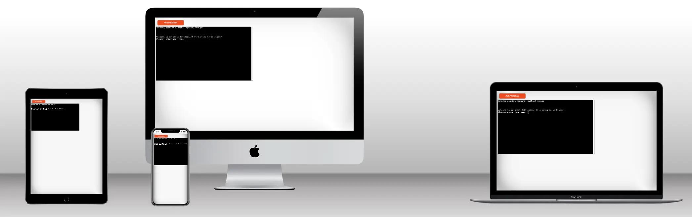

<h1>CHALLENGE 3 | PYTHON : THE BATTELSHIP</h1>

<a style="text-decoration:underline;" target="_blank" href="https://code-insti-portfolio3-py-3d5d6c3645a4.herokuapp.com/">View the LIVE project here</a>

<h2>Background</h2>
This battelship game is a build on python. 
The goal of this game is to hit all the computer ships before he hits yours.
The first one hitting all the ship of the other is the winner.

<h2>How to play</h2>
<ol>
    <li>Enter your name</li>
    <li>Let the software create two boards with ships on it</li>
    <li>Guess where the computer ships are by entering a position : row and col.</li>
    <li>Let the computer do the same for your ships</li>
    <li>Let the software check if you and the computer hit or miss the enemy ships</li>
    <li>Let the software print you new boards and the new results with your scores</li>
    <li>Enter if you still want to continue the game</li>
    <li>Repeat the guessing step until the game is over</li>
</ol>

For you information, the board are 3 on 3 with 2 ships to facilitate the testing of the game. The user ship position are marked with a S. Hits on the boards are notify by a X and miss by a O.

<h2>Feature</h2>

<h3>Existing feature</h3>
<ul>
    <li>Random board creation </li>
        <ul>
            <li>Creation of the board of the user and of the computer</li>
            <li>Calculation of the users and computers ships position</li>
            <li>Display of the users ships positio on his board</li>
            <li>No display of the computer ships position on his board</li>
        </ul>
    <li>Capture of the user computer ships position guesses</li>
    <li>Cross check of the user guesses validity </li>
        <ul>
            <li>Only integer input</li>
            <li>Only position inside the board</li>
            <li>Only position that have not already been given</li>
        </ul>
    <li>Random creation of the computer guesses inside the board size</li>
    <li>Cross check of the computer guesses have not been already made</li>
    <li>Count of the hits</li>
    <li>Printing of the updated board and the round results</li>
    <li>Opportunity to stop the game after each round</li>
    <li>Print of the winner once the game is over</li>
</ul>

<h3>Next feature</h3>
<ul>
    <li>Choice of the size of the board</li>
    <li>Choice of number and size of the ships on the board</li>
    <li>Entering the position of the computer ship with number form 1 to ... instead fo the 0 to...</li>
    <li>Possiblity to play online against other humain player</li>
    <li>Management the ex aequo case</li>
</ul>

<h2>Data model</h2>

I choose to follow the same pattern of the code institue battelship game.

I buil a Board class with all function inside and I activated them in the main function making the game come alive.

Two board (instances) are build out of the board class to allow the game to happen.

<h2>Testing</h2>

<ul>
    <li>I tested the game (and the error scenarios) on VSC and Heroku, no problem found</li>
    <li>I tested the game on PEP8, no problem found</li>
    <li>My 8 years of boy tested, his comment "Cool Dady"</li>
</ul>

<h2>Testing</h2>

<h3>Solved bug</h3>

<ul>
    <li>I regularly forgot to put ":" after defining my function.</li>
    <li>I tried first to update the target position from the user and the computer inside the class, but I was putting the user and the computer guess in the same list and creating confusion between you targeted what position</li>
    <li>I did put "," between the argument of my functions creating bugs </li>
    <li>I first didn't define my score var in the main as global creating a scope issue.</li>
</ul>

<h3>Existing bug : None</h3>

<h2>Deployement</h2>

<ol>
    <li>Fork or clone this repository</li>
    <li>Create a new Heroku app</li>
    <li>Set the buildbacks to Python and NodeJS in this order</li>
    <li>Link the Heroku app to the repository</li>
    <li>Deploy</li>
</ol>

<h2>Credits</h2>
<ol>
    <li>Thanks to Code Institute for the project idea and the coding direction presented</li>
    <li>Thanks to Code Institute for the readme model</li>
    <li>Thanks to Spence, my mentor, for his support.</li>
</ol>
