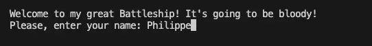
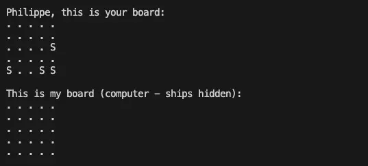
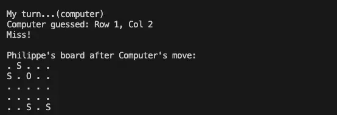

<h1>CHALLENGE 3 | PYTHON - THE BATTELSHIP</h1>

<a style="text-decoration:underline;" target="_blank" href="https://code-insti-portfolio3-py-3d5d6c3645a4.herokuapp.com/">View the LIVE project here</a>

<h2>Background</h2>
This Battleship game is built in Python. The objective is to sink all of the computer's ships before it sinks yours. The player who sinks all the opponent's ships first is the winner.

<h2>How to play</h2>
<ol>
    <li>Please enter your name.</li>
     
    <li>Have the program generate two boards, each with ships placed on them.</li>
     
    <li>Try to guess the location of the computer's ships by entering a position: row and column.</li>
     
    <li>Let the computer attempt to guess the locations of your ships as well.</li>
     
    <li>Let the program verify if you or the computer hit or missed the enemy's ships.</li>
    <li>Have the program display the updated boards and show the current scores after each round.</li>
     
    <li>Continue repeating the guessing step until all ships are sunk and the game is over.</li>
</ol>

For your information, the boards are 5x5 in size, each with 4 ships. The user's ship positions are marked with an 'S'. Hits on the boards are indicated by an 'X', and misses are marked with an 'O'.

<h2>Feature</h2>

<h3>Existing Features</h3>
<ul>
    <li>Random Board Creation</li>
        <ul>
            <li>Creation of both the user's and computer's boards</li>
            <li>Calculation of the ship positions for both the user and the computer</li>
            <li>Computer's ship positions remain hidden on its board</li>
        </ul>
    <li>Capture of the user's guesses for the computer's ship positions</li>
    <li>Cross-check of the user's guesses for validity</li>
        <ul>
            <li>Only integer input allowed</li>
            <li>Guess must be within the board boundaries</li>
            <li>Guess cannot have been made previously</li>
        </ul>
    <li>Random generation of computer's guesses within the board size</li>
    <li>Cross-check to ensure computer's guesses are not repeated</li>
    <li>Tracking of hits</li>
    <li>Display of the updated boards and the results for each round</li>
    <li>Display of the winner once the game is over</li>
</ul>

<h3>Next Features</h3>
<ul>
    <li>Option to choose the board size</li>
    <li>Option to select the number and size of ships on the board</li>
    <li>Allow input for ship positions using numbers starting from 1 instead of 0</li>
    <li>Ability to play online against other human players</li>
    <li>Option to leave the game without having to ask the question after each loop</li>
    <li>Managing the error when entering a number outside the rade at a line or colomn level and not after having entered both</li>
</ul>

<h2>Programming languages and libraries</h2>
<ul>
    <li>Python</li>
    <li>Randint from Random</li>
</ul>

<h2>Data Model</h2>

I chose to follow the structure of the Code Institute Battleship game.

I built a `Board` class with all the main functions, and I activated them, with the functions outside the `Board` in the main function to make the game work.

Two boards (instances) are created from the `Board` class, allowing the game to take place.

<h2>Testing</h2>

<ul>
    <li>I tested the game (and various error scenarios) in Visual Studio Code and on Heroku; no issues were found.</li>
    <li>I tested the game using PEP8, finding no critical issues. However, there were around 100 spacing issues, all of which were fixed.</li>
     
    <li>My 8-year-old son tested the game, and his feedback was, "Cool, Daddy!"</li>
    <li>For testing purposes, I reduced the board size to 2x2 and limited the number of ships to 1, to verify the result displays.</li>
</ul>

<h3>BDD</h2>

<table border="1">
  <tr>
    <th>Feature</th>
    <th>Status</th>
  </tr>
  <tr>
    <td>Name - Input handling</td>
    <td>OK</td>
  </tr>
  <tr>
    <td>Name - Error handling for empty input</td>
    <td>OK</td>
  </tr>
  <tr>
    <td>Name - Trimming unnecessary spaces</td>
    <td>OK</td>
  </tr>
  <tr>
    <td>Column and row - Input handling</td>
    <td>OK</td>
  </tr>
  <tr>
    <td>Column and row - Error handling for empty input</td>
    <td>OK</td>
  </tr>
  <tr>
    <td>Column and row - Error handling for non-numeric input</td>
    <td>OK</td>
  </tr>
  <tr>
    <td>Column and row - Error handling for input out of range</td>
    <td>OK</td>
  </tr>
  <tr>
    <td>Column and row - Error handling for already guessed positions</td>
    <td>OK</td>
  </tr>
  <tr>
    <td>Winner - Message for computer's victory</td>
    <td>OK</td>
  </tr>
  <tr>
    <td>Winner - Message for user's victory</td>
    <td>OK</td>
  </tr>
  <tr>
    <td>Winner - Message for a tie (ex-aequo)</td>
    <td>OK</td>
  </tr>
</table>

<h3>Solved Bugs</h3>
<ul>
    <li>I often forgot to put ":" after defining functions.</li>
    <li>Initially, I updated the target positions for both the user and the computer in the same list, causing confusion about who targeted which position.</li>
    <li>I mistakenly added commas between the arguments of my functions, which caused bugs.</li>
    <li>Initially, I didn't define the `score` variable as global in the main function, causing a scope issue.</li>
    <li>PEP8 flagged some necessary and unnecessary spacing issues, all of which were resolved.</li>
    <li>While asking for the player’s name, the input wasn't being correctly validated, which I fixed based on my mentor's advice.</li>
    <li>I had to add a message in case of a tie (ex aequo).</li>
    <li>To improve usability, I added the option to answer "Y" as well as "y" to the prompt asking if the player wants to continue playing.</li>
    <li>The computer's guesses were being recorded in the user's guess variable, which I corrected.</li>
    <li>The Board class and the main function have been refactored to improve modularity and reduce their length.</li>
    <li>Input validation has been improved to prevent unhandled exceptions and ensure the app remains responsive.</li>
    <li>Redundant prompts removed: The 'Are you ready for the next round?' question was eliminated to streamline gameplay as requested in the project assesment.</li>
    <li>Descriptive docstrings were improved for function to enhance clarity.</li>
   <li>Improvement of grammar and spelling in the texts.</li>

</ul>

<h3>Existing Bugs: None</h3>

<h2>Deployment</h2>
<ol>
    <li>Fork or clone this repository</li>
    <li>Create a new Heroku app</li>
    <li>Set the buildpacks to Python and Node.js, in that order</li>
    <li>Link the Heroku app to the repository</li>
    <li>Deploy</li>
</ol>

<h2>Credits</h2>
<ol>
    <li>Thanks to Code Institute for the project idea and the guidance provided throughout the coding process.</li>
    <li>Thanks to Code Institute for the README model. I aimed to adhere as closely as possible to this model to meet expectations.</li>
    <li>Thanks to Spence, my mentor, for his support.</li>
</ol>
